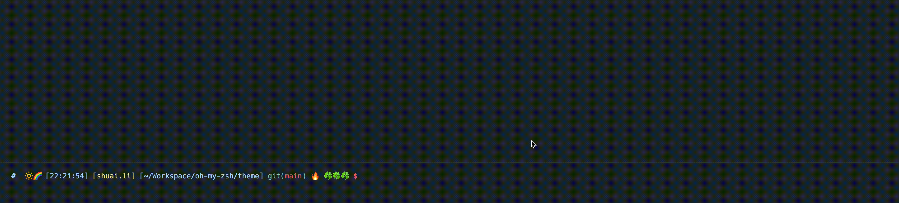

# Oh My Zsh Theme
## Introducion
I created a new theme, it's called 🎉 **smooth** 🎉 , hope everyone will feel smooth using it.

- time prompt will update once you finish inputting.
- time duration will show after command running, you can see the duration in the second column of prompt.

## Usage
REF: [Oh-My-Zsh External themes](https://github.com/ohmyzsh/ohmyzsh/wiki/External-themes)
